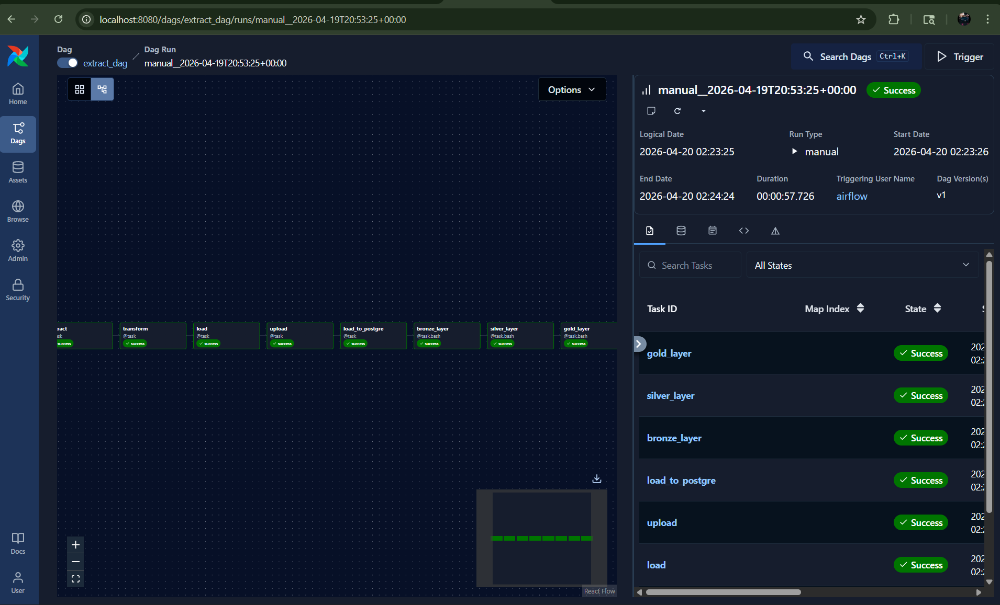
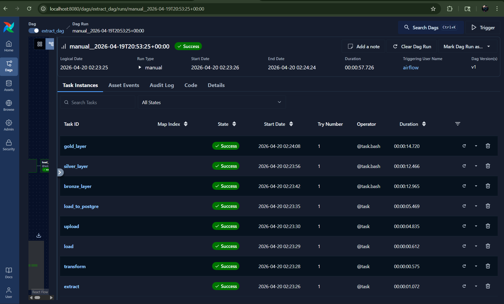
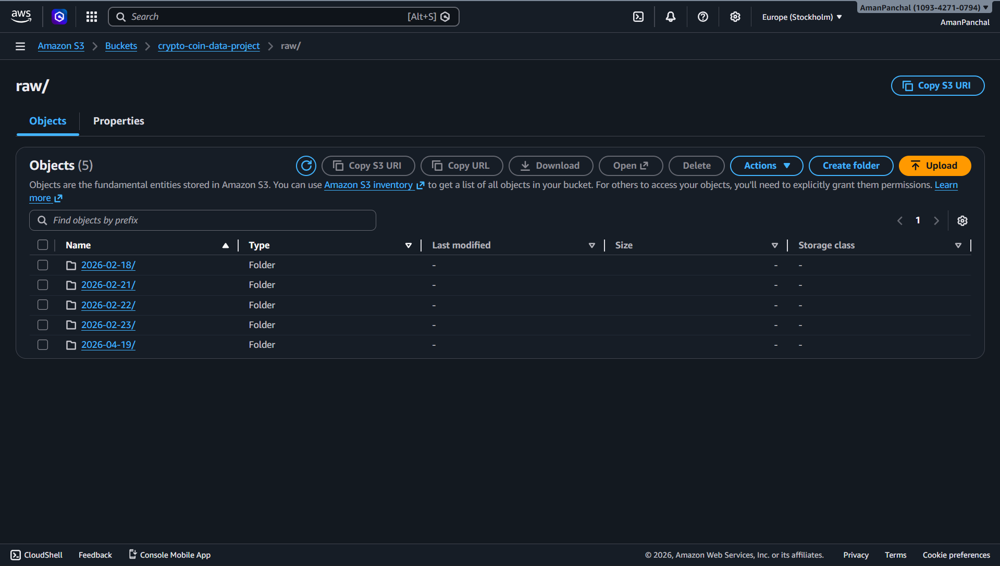

# 🪙 Crypto Data Pipeline

An end-to-end data engineering pipeline that ingests live cryptocurrency data from the CoinGecko API, stores it in AWS S3, loads it into PostgreSQL, and transforms it using dbt with a Medallion Architecture — all orchestrated by Apache Airflow on Docker.

---

## 🏗️ Architecture

```
CoinGecko API
     ↓
Extract & Transform (Python)
     ↓
Parquet (local /opt/airflow/data)
     ↓
AWS S3 (raw/{date}/crypto_data.parquet)
     ↓
PostgreSQL (staging.stg_coin_data)
     ↓
dbt — Bronze → Silver → Gold
     ↓
Analytics Ready Tables
```

---

## 🛠️ Tech Stack

| Tool | Purpose |
|---|---|
| Python | Extract, Transform, Load |
| Apache Airflow | Orchestration (TaskFlow API) |
| AWS S3 | Raw data lake storage |
| PostgreSQL | Staging + analytical tables |
| dbt | Data modelling (Medallion Architecture) |
| Docker | Local containerized environment |
| PyArrow | Parquet file handling |

---

## 📁 Project Structure

```
project-2/
├── dags/
│   └── extract_dag.py        # Main Airflow DAG
├── src/
│   ├── extract/
│   │   └── extract_coin.py   # CoinGecko API call
│   ├── transform/
│   │   └── transform_coin.py # Data transformation
│   ├── load/
│   │   └── load_coin.py      # Save to Parquet
│   ├── load_to_s3/
│   │   └── load_s3.py        # Upload to S3
│   └── s3_to_postgre/
│       └── load_to_postgre.py# S3 → PostgreSQL
├── coin_data_project/        # dbt project
│   └── models/
│       ├── bronze/           # Raw incremental layer
│       ├── silver/           # Cleaned layer
│       └── gold/             # Analytics layer
├── .env.example
├── docker-compose.yml
└── README.md
```

---

## 🥉🥈🥇 dbt Medallion Architecture

### Bronze
- Raw data loaded from `staging.stg_coin_data`
- Incremental model — only new records processed

### Silver
- Cleaned and properly typed data
- Deduplicated records

### Gold
| Model | Description |
|---|---|
| `dim_coin` | Coin dimension table |
| `dim_data` | Data dimension table |
| `fact_coin` | Core fact table |
| `top_10_coin` | Top 10 coins by market cap |
| `gold_everyday_market` | Daily market snapshot |
| `gold_growth_analysis` | Growth metrics analysis |

---

## 📸 Pipeline in Action

### Airflow DAG
<!-- Add screenshot: assets/screenshots/airflow_dag.png -->


### Successful DAG Run
<!-- Add screenshot: assets/screenshots/airflow_success.png -->


### PostgreSQL Data
<!-- Add screenshot: assets/screenshots/postgres_data.png -->


### S3 Bucket Structure
<!-- Add screenshot: assets/screenshots/s3_bucket.png -->


---

## ⚙️ Setup & Run

### Prerequisites
- Docker & Docker Compose
- AWS Account (S3 bucket)
- Python 3.10+

### Steps

**1. Clone the repository**
```bash
git clone https://github.com/AmanPanchal3110/crypto-data-pipeline.git
cd crypto-data-pipeline
```

**2. Setup environment variables**
```bash
cp .env.example .env
# Fill in your AWS and PostgreSQL credentials in .env
```

**3. Start Docker containers**
```bash
docker-compose up -d
```

**4. Open Airflow UI**
```
http://localhost:8080
```

**5. Add Airflow Connections**
- `aws_default` — Your AWS credentials
- `postgres_default` — Your PostgreSQL connection

**6. Trigger the DAG**
- Find `extract_dag` in Airflow UI
- Click ▶️ to trigger manually

---

## 🔑 Environment Variables

Copy `.env.example` to `.env` and fill in:

```
AWS_ACCESS_KEY_ID=your_key_here
AWS_SECRET_ACCESS_KEY=your_secret_here
AWS_DEFAULT_REGION=your_region_here
POSTGRES_USER=your_user_here
POSTGRES_PASSWORD=your_password_here
POSTGRES_DB=your_db_here
```