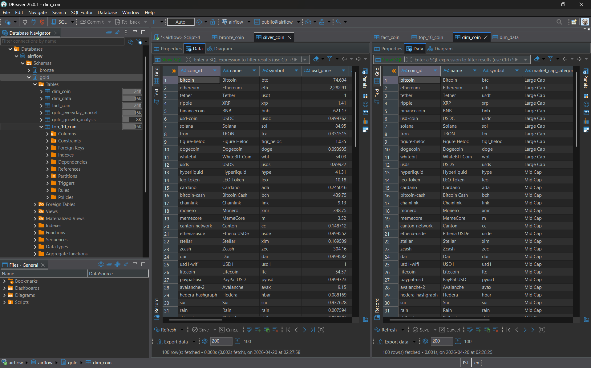

# 🔄 dbt - Coin Data Project

Data transformation layer using dbt with Medallion Architecture (Bronze → Silver → Gold).

---

## 📊 Models Overview

### 🥉 Bronze Layer
| Model | Materialization | Description |
|---|---|---|
| `bronze_coin` | Incremental | Raw data from staging, only new records loaded |

### 🥈 Silver Layer
| Model | Materialization | Description |
|---|---|---|
| `silver_coin` | Table | Cleaned, typed, and deduplicated data |

### 🥇 Gold Layer
| Model | Materialization | Description |
|---|---|---|
| `dim_coin` | Table | Coin dimension with market cap category |
| `dim_data` | Table | Data dimension table |
| `fact_coin` | Table | Core fact table with price and volume |
| `top_10_coin` | Table | Top 10 coins by market cap |
| `gold_everyday_market` | Table | Daily market snapshot |
| `gold_growth_analysis` | Table | Growth metrics per coin |

---

## 🗂️ Data Flow

```
staging.stg_coin_data (PostgreSQL)
          ↓
       Bronze
    (incremental)
          ↓
       Silver
     (cleaned)
          ↓
        Gold
  (analytics ready)
    ┌─────┴─────┐
  dim_coin   fact_coin
  dim_data   top_10_coin
             gold_everyday_market
             gold_growth_analysis
```

---

## 📸 Gold Layer Tables

### silver_coin + dim_coin


---

## ▶️ Run dbt Models

```bash
# Run all models
dbt run --target docker

# Run specific layer
dbt run --target docker --select bronze_coin
dbt run --target docker --select silver_coin
dbt run --target docker --select gold

# Run tests
dbt test

# Generate docs
dbt docs generate
dbt docs serve
```

---

## 🔗 Source

Data comes from `staging.stg_coin_data` table in PostgreSQL, loaded via Airflow pipeline from CoinGecko API.